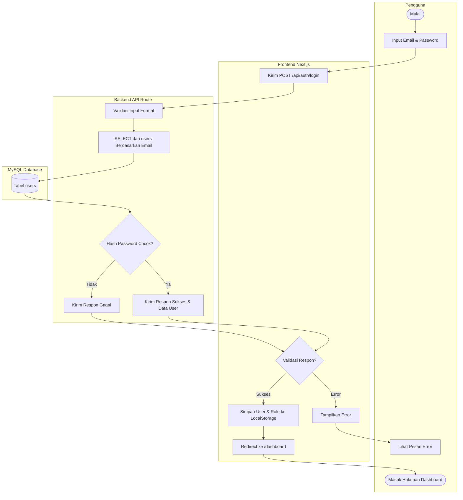
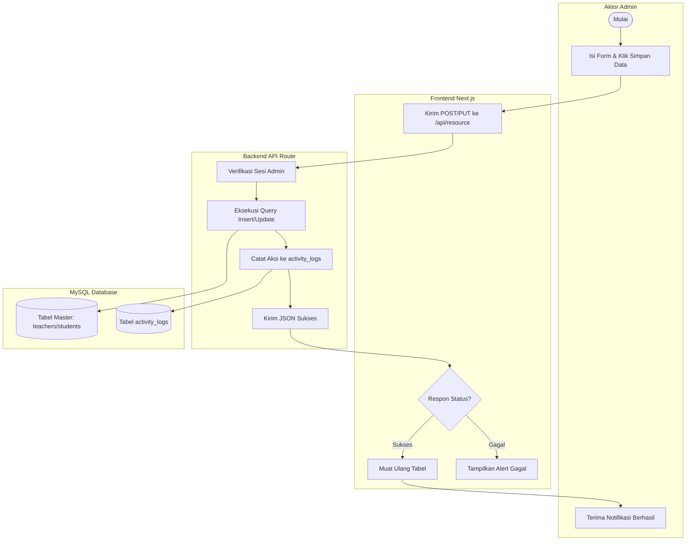
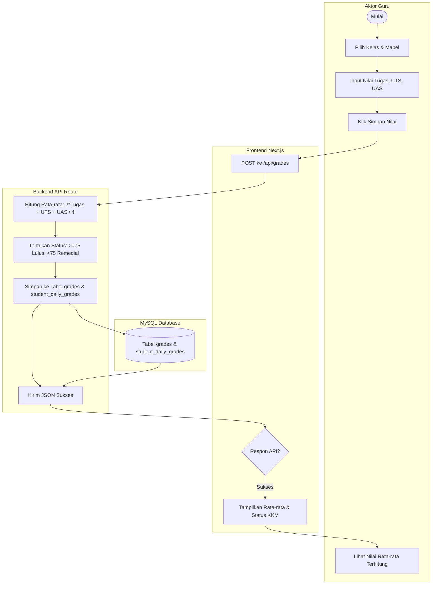
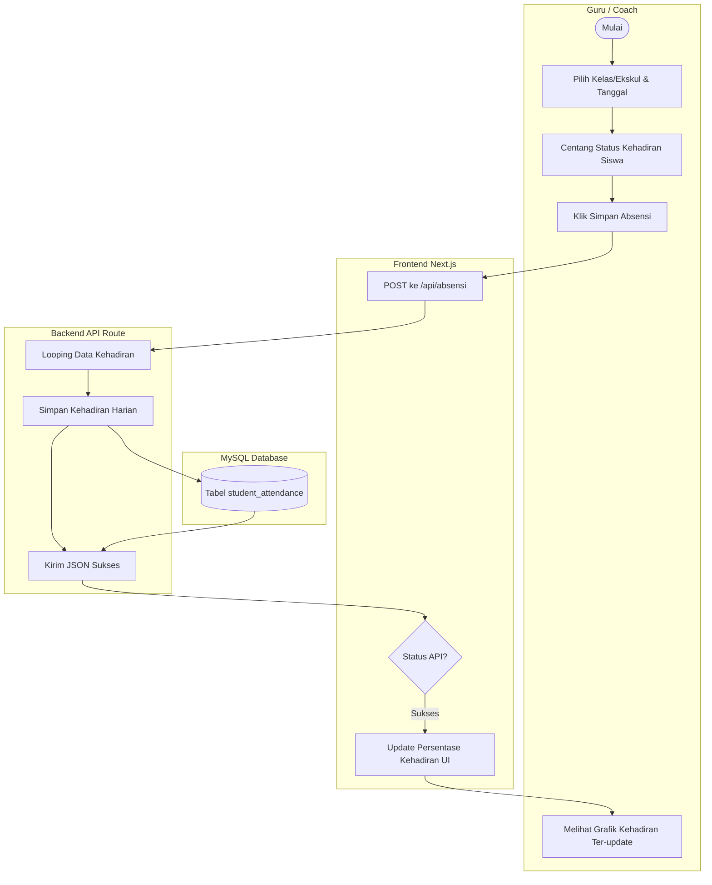
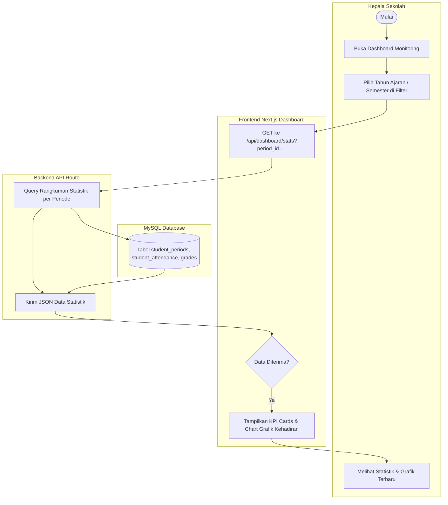
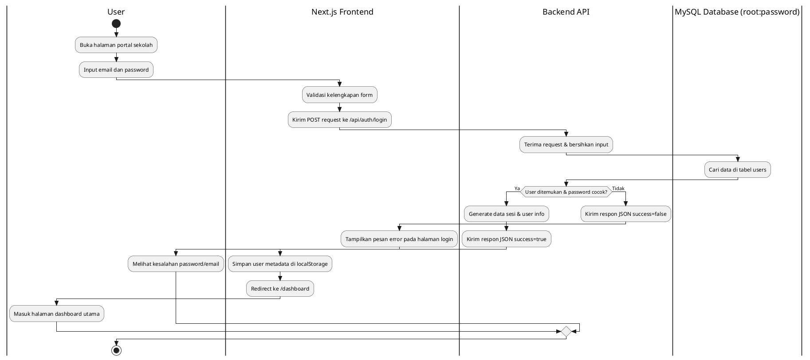

# Prompts & Code untuk Activity Diagram Skripsi (Dashboard Monitoring)

Dokumen ini berisi kumpulan **Prompt Gambar AI (AI Image Generator)**, **Kode Diagram Engine (Mermaid & PlantUML)**, serta **Pseudocode** untuk 5 alur sistem utama pada project Next.js Dashboard Monitoring Sekolah SD Islam Baiturrachman (dengan database MySQL `root` / `""`).

Anda dapat menyalin bagian yang relevan sesuai dengan jenis AI/generator yang ingin Anda gunakan.

---

## 1. PROMPT UNTUK AI IMAGE GENERATOR (DALL-E 3 / Midjourney / Stable Diffusion)
*Prompt ini dirancang dengan deskripsi visual detail untuk menghasilkan gambar diagram aktivitas akademis berkualitas tinggi.*

### Alur 1: Proses Login & Setup Sesi Pengguna
> **Prompt:**
> A professional academic UML activity diagram showing a user login flow. The diagram consists of 4 clean vertical swimlanes (columns) labeled: "User", "Next.js Client", "Backend API Route", and "MySQL Database". The background is clean white. Diagram elements include rounded rectangles for actions, diamonds for decision points, and arrows showing the flow. The color palette is a professional academic blue, dark slate, and soft gray. The diagram starts with "User enters email and password" in the first swimlane, flows to "Submit form" in the Next.js Client swimlane, moves to "Validate credentials" in the API swimlane, queries the database, handles password verification, and ends with "Redirect to Dashboard" or "Show Error Message". Flat vector style, clean lines, high-resolution graphic, highly legible, corporate educational style.

### Alur 2: Pengelolaan Data Master & Pencatatan Log Aktivitas (Admin)
> **Prompt:**
> A clean and structured UML activity diagram illustrating the administrative data management process. The diagram is divided into 4 swimlanes: "Admin", "Next.js Frontend", "Backend API", and "MySQL Database". It starts with "Admin fills form and clicks save", flows through "Frontend client validations", "API authorization check", "Database write query", and "System logs action to activity_logs table". The design uses standard flowchart icons (start, process, database, end), solid black connection lines with arrowheads, and a minimalist color theme of dark blue, cyan, and light gray on a white background. No chaotic elements, clean academic layout.

### Alur 3: Pengisian & Perhitungan Nilai Siswa (Guru)
> **Prompt:**
> A detailed system activity diagram showing how teachers input and calculate student grades. The diagram has 4 clear swimlanes: "Teacher", "Next.js Client", "API Route (/api/grades)", and "MySQL Database". The flow shows the teacher inputting Assignment, UTS, and UAS scores. It shows the backend API calculating the average using the formula (2 * Assignment + UTS + UAS) / 4, checking if average is >= 75 to determine "Lulus" or "Remedial" status, and saving the output in the "grades" and "student_daily_grades" tables. Flat vector layout, academic thesis presentation style, clean boxes and arrows, professional gray-blue color palette.

### Alur 4: Pengisian Presensi Harian Siswa (Guru / Coach)
> **Prompt:**
> An academic-grade UML activity diagram showing the daily attendance input process. 4 vertical swimlanes: "Teacher / Coach", "Next.js Client", "API Route (/api/absensi)", and "MySQL Database". The flow starts with selecting class/extracurricular and date, entering attendance status (Hadir, Sakit, Izin, Alfa) for each student, sending a bulk POST request, performing a SQL "INSERT ON DUPLICATE KEY UPDATE" query to the "student_attendance" table, and updating the dashboard chart. Vector graphics, neat diagram blocks, sharp text labels, professional indigo and slate color scheme.

### Alur 5: Monitoring Dashboard & Filter Periode (Kepala Sekolah)
> **Prompt:**
> A software engineering UML activity diagram depicting a read-only dashboard monitoring flow for the Principal (Kepala Sekolah). The diagram has 4 swimlanes: "Principal", "Next.js Frontend Dashboard", "Backend Statistics API", and "MySQL Database". The flow starts with the Principal opening the page and selecting an academic period from a dropdown filter. The client sends a GET request to the statistics API, which executes SELECT queries on database tables (student_periods, student_attendance, grades). The statistics are processed, sent back as JSON, and rendered as charts and KPI cards on the UI. High quality vector diagram, clean lines, academic style, minimal aesthetics.

---

## 2. KODE DIAGRAM ENGINE (Copas untuk Generator Gambar Berbasis Kode)
*Salin kode di bawah ini ke tool seperti **Mermaid Live Editor** atau **PlantUML Text-to-Diagram**.*

### A. Format Mermaid (Rekomendasi untuk Markdown/GitHub)

#### Alur 1: Proses Login & Setup Sesi


#### Alur 2: Pengelolaan Data Master & Log Aktivitas (Admin)


#### Alur 3: Pengisian & Perhitungan Nilai Siswa (Guru)


#### Alur 4: Pengisian Presensi Harian Siswa (Guru / Coach)


#### Alur 5: Monitoring Dashboard & Filter Periode (Kepala Sekolah)


---

### B. Format PlantUML (Alternatif untuk Visualisasi Akademis)



---

## 3. PSEUDOCODE SYSTEM FLOW (Untuk Deskripsi Bab IV Skripsi)
*Format ini berguna untuk mendeskripsikan secara logis jalannya sistem pada dokumen tertulis skripsi.*

```
ALUR_INPUT_NILAI_AKADEMIS:
--------------------------
1. BACA input Guru:
   - class_id (Kelas)
   - class_subject_id (Mata Pelajaran & Guru Pengampu)
   - period_id (Periode Akademik Aktif)
   - student_id (Siswa)
   - scores (tugas_harian[], nilai_uts, nilai_uas)

2. JIKA class_id, class_subject_id, ATAU student_id kosong MAKA:
      TAMPILKAN "Parameter tidak lengkap"
      HENTIKAN PROSES
   AKHIR_JIKA

3. HITUNG rata-rata nilai tugas harian:
      tugas_avg = SUM(tugas_harian[]) / COUNT(tugas_harian[])

4. HITUNG nilai akhir (average):
      nilai_akhir = (2 * tugas_avg + nilai_uts + nilai_uas) / 4

5. JIKA nilai_akhir >= 75.00 MAKA:
      status = "Lulus"
   MELAINKAN:
      status = "Remedial"
   AKHIR_JIKA

6. HUBUNGKAN ke Database MySQL (user: "root", password: "")
7. SIMPAN ke tabel `grades` (dengan student_period_id & class_period_id):
      INSERT INTO grades (student_period_id, class_period_id, daily_assignment, uts, uas, average, status)
      VALUES (student_period_id, class_period_id, tugas_avg, nilai_uts, nilai_uas, nilai_akhir, status)
      ON DUPLICATE KEY UPDATE daily_assignment=tugas_avg, uts=nilai_uts, uas=nilai_uas, average=nilai_akhir, status=status;

8. KIRIM RESPON JSON SUKSES ke Frontend untuk memperbarui UI.
```
