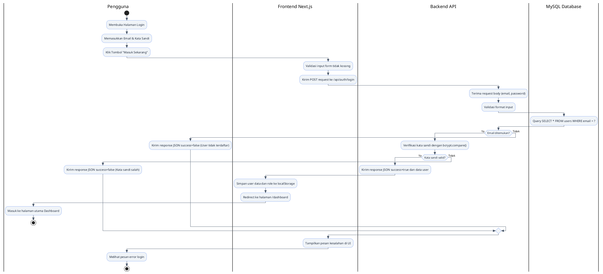
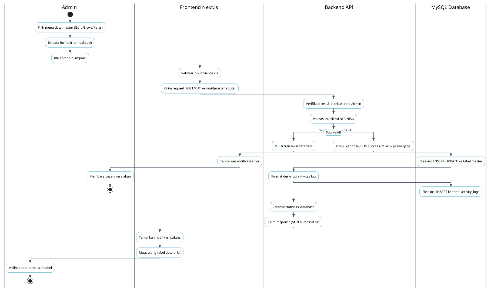
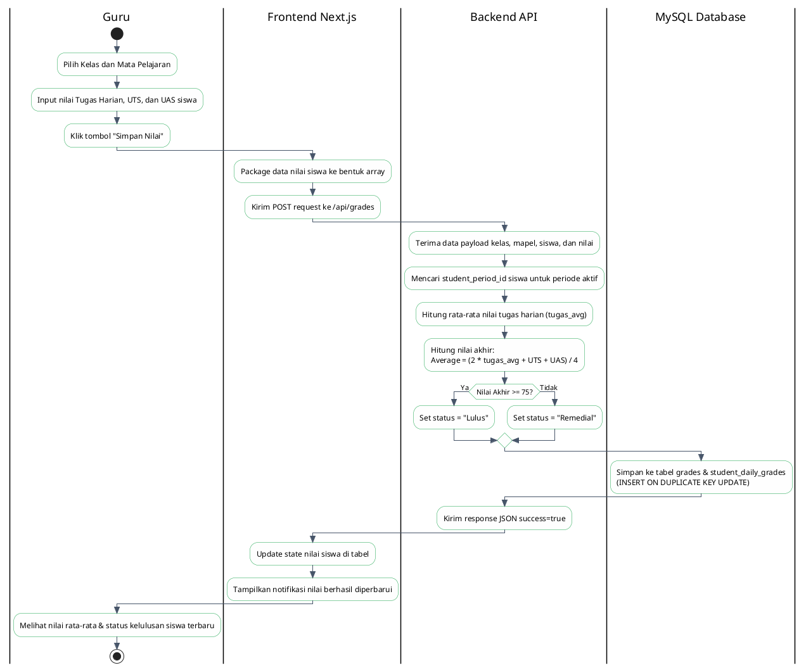
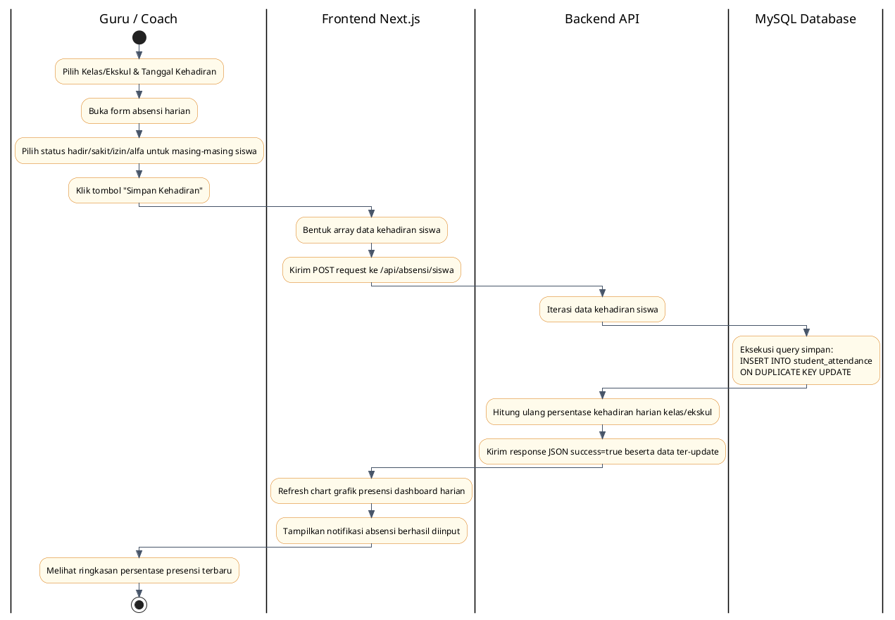
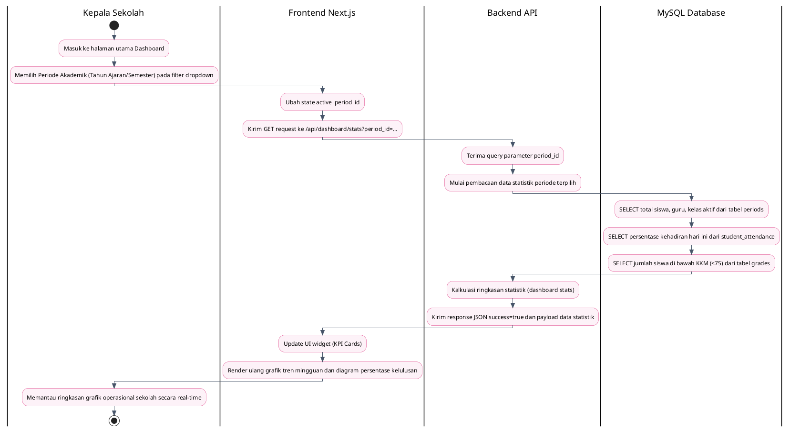

# Kode PlantUML Lengkap (Activity Diagram Skripsi)

Dokumen ini berisi kode **PlantUML** lengkap untuk 5 diagram aktivitas utama sistem monitoring sekolah SD Islam Baiturrachman. Anda dapat langsung menyalin kode di bawah ini dan menempelkannya ke compiler PlantUML pilihan Anda (misalnya [PlantUML Online Server](http://www.plantuml.com/plantuml/) atau ekstensi PlantUML di VS Code) untuk menghasilkan gambar diagram berkualitas akademik.

---

## 1. Alur Autentikasi Pengguna (Login & Sesi)

---

## 2. Pengelolaan Data Master (CRUD) & Log Aktivitas (Admin)

---

## 3. Pengisian & Perhitungan Nilai Siswa (Guru)

---

## 4. Pengisian Presensi Harian Siswa (Guru / Coach)

---

## 5. Monitoring Dashboard & Filter Periode (Kepala Sekolah)

